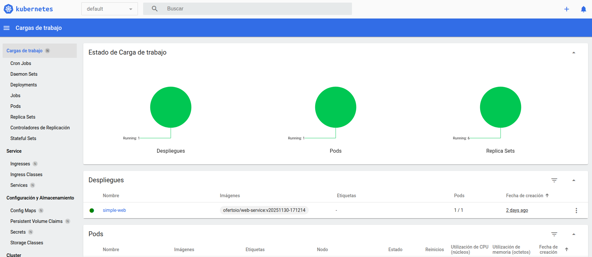

# Description
In this repository we try to explain how we can deploy a [minikube](https://minikube.sigs.k8s.io/docs/) cluster

## Deployment

-- **STEP01**: install minikube

For example to install the latest minikube stable release on x86-64 Linux using binary download
```
$ curl -LO https://github.com/kubernetes/minikube/releases/latest/download/minikube-linux-amd64
$ sudo install minikube-linux-amd64 /usr/local/bin/minikube && rm minikube-linux-amd64
```

-- **STEP02**: Start your cluster
From a terminal with administrator access (but not logged in as root), run:

```
$ minikube start
😄  minikube v1.32.0 en Ubuntu 20.04 (vbox/amd64)
🎉  minikube 1.37.0 is available! Download it: https://github.com/kubernetes/minikube/releases/tag/v1.37.0
💡  To disable this notice, run: 'minikube config set WantUpdateNotification false'

✨  Using the docker driver based on existing profile
👍  Starting control plane node minikube in cluster minikube
🚜  Pulling base image ...
🔄  Restarting existing docker container for "minikube" ...
🐳  Preparando Kubernetes v1.28.3 en Docker 24.0.7...
🔗  Configurando CNI bridge CNI ...
🔎  Verifying Kubernetes components...
    ▪ Using image docker.io/kubernetesui/dashboard:v2.7.0
    ▪ Using image docker.io/kubernetesui/metrics-scraper:v1.0.8
    ▪ Using image gcr.io/k8s-minikube/storage-provisioner:v5
💡  Some dashboard features require the metrics-server addon. To enable all features please run:

	minikube addons enable metrics-server	


🌟  Complementos habilitados: storage-provisioner, default-storageclass, dashboard
🏄  Done! kubectl is now configured to use "minikube" cluster and "default" namespace by default
```

-- **STEP03**: Deploy somme addons in minikube

Minikube offer a lot of addons to be enable. We will you the Dashboard and the ingress addons
```
$ minikube addons list

$ minikube addons enable dashboard 
$ minikube addons enable ingress
```

-- **STEP04**: Interact with your cluster from CLI

Minikube not only start the cluster also, configured kubectl to interact with it, so now you can interact with the cluster is your installed the kubectl CLI first

```
$ kubectl get namespaces
AME                   STATUS   AGE
default                Active   35d
kube-node-lease        Active   35d
kube-public            Active   35d
kube-system            Active   35d
kubernetes-dashboard   Active   35d
```

Minikube carry a kubectl version and you can use it if you prefer:

```
$ minikube kubectl -- get namespaces
AME                   STATUS   AGE
default                Active   35d
kube-node-lease        Active   35d
kube-public            Active   35d
kube-system            Active   35d
kubernetes-dashboard   Active   35d
```

Create an alias for kubectl command to be not verbose:

```
$ alias kubectl="minikube kubectl --"
$ kubectl get namespaces
AME                   STATUS   AGE
default                Active   35d
kube-node-lease        Active   35d
kube-public            Active   35d
kube-system            Active   35d
kubernetes-dashboard   Active   35d
```

-- **STEP05**: Interact with your cluster from Dashboard
After installed dashboard addon we must first a proxy to connect to the dashboard service. minikube offer a this commans:

```
$ minikube dashboard
🤔  Verifying dashboard health ...
🚀  Launching proxy ...
🤔  Verifying proxy health ...
🎉  Opening http://127.0.0.1:37407/api/v1/namespaces/kubernetes-dashboard/services/http:kubernetes-dashboard:/proxy/ in your default browser...
Se está abriendo en una sesión de navegador existente.
```

